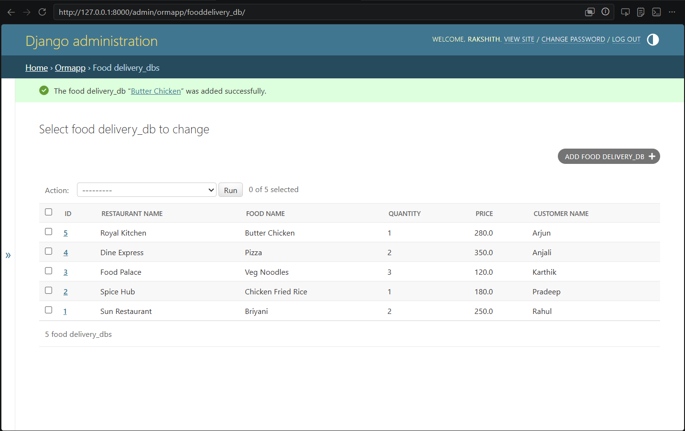

# Ex01 Django ORM Web Application
## Date: 18/05/2026

## AIM
To develop a Django application to manage an online food delivery platform like Zomato/Swiggy using Object Relational Mapping (ORM).

## ENTITY RELATIONSHIP DIAGRAM


## DESIGN STEPS

### STEP 1:
Clone the problem from GitHub

### STEP 2:
Create a new app in Django project

### STEP 3:
Enter the code for admin.py and models.py

### STEP 4:
Execute Django admin and create details for 10 books

## PROGRAM
```
Models.py:

from django.db import models

class FoodDelivery_DB(models.Model):
    restaurant_name = models.CharField(max_length=100)
    food_name = models.CharField(max_length=100)
    quantity = models.IntegerField()
    price = models.FloatField()
    customer_name = models.CharField(max_length=100)
    address = models.TextField()

    def __str__(self):
        return self.food_name

Admin.py:

from django.contrib import admin
from .models import FoodDelivery_DB


class FoodDelivery_DBAdmin(admin.ModelAdmin):
    list_display = (
        'id',
        'restaurant_name',
        'food_name',
        'quantity',
        'price',
        'customer_name'
    )


admin.site.register(FoodDelivery_DB, FoodDelivery_DBAdmin)

```
## OUTPUT



## RESULT
Thus the program for creating a database using ORM hass been executed successfully
